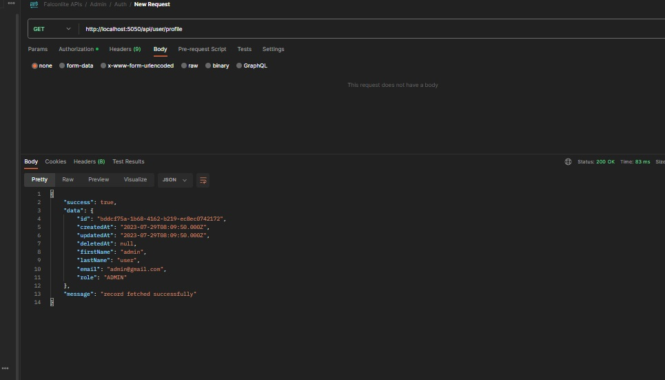
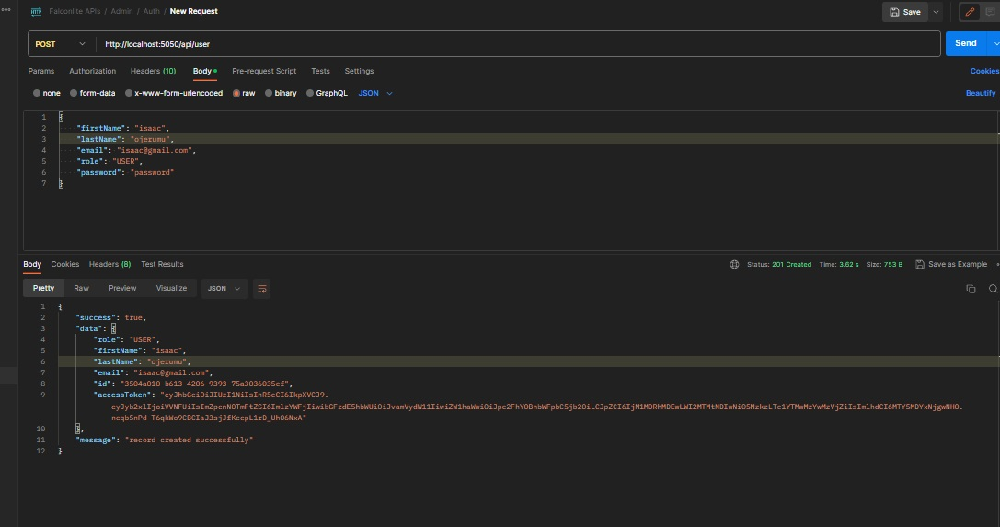
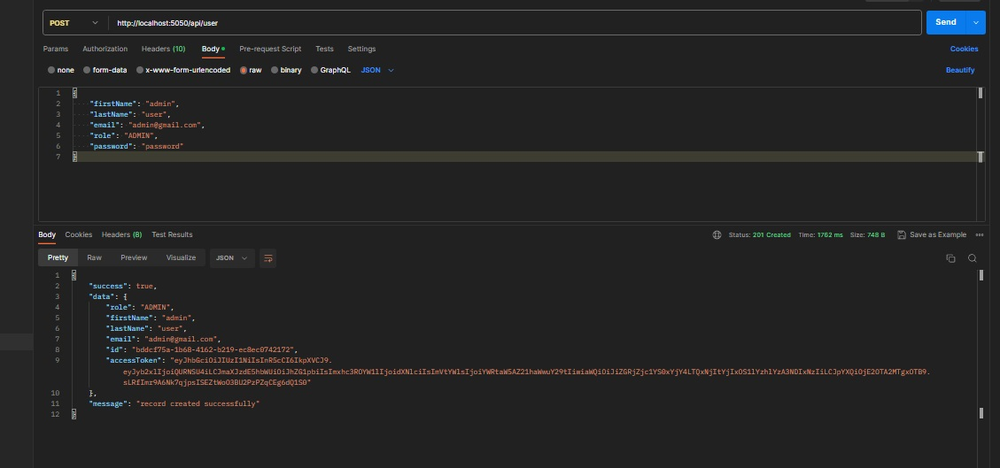
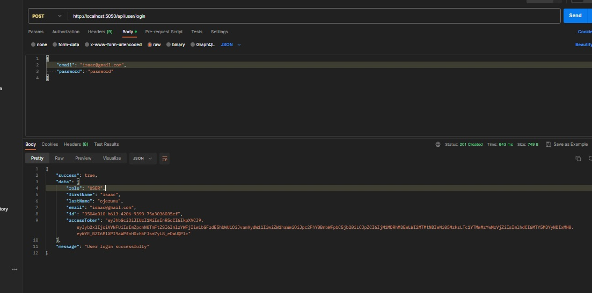
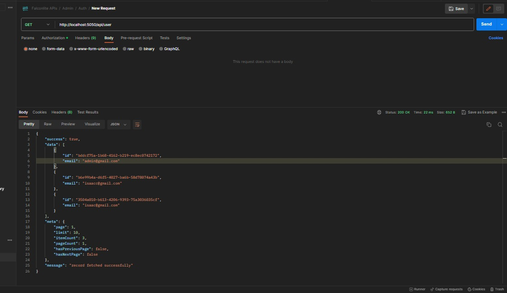
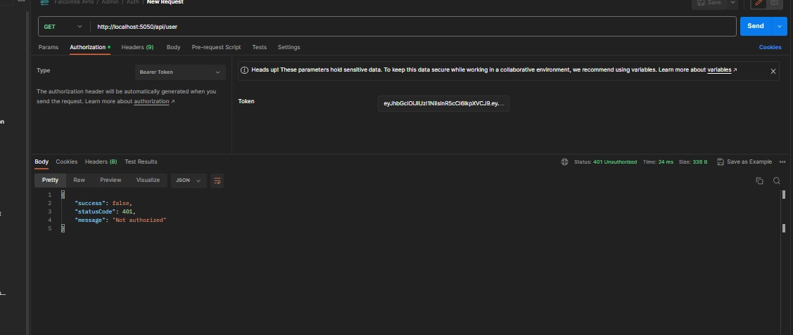
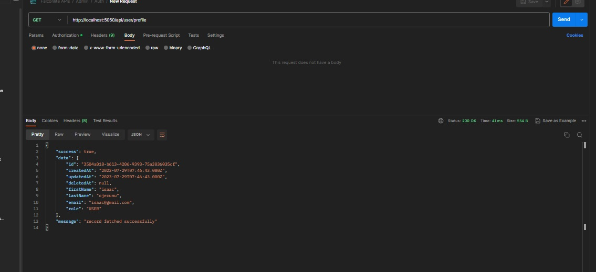

# NERDBURG BACKEND SERVICE
This is the backend service API for Nerdburg powered by Nodejs, Nestjs and TS.

## Requirements
- NodeJS runtime
- NPM or Yarn package manager
- MySQL Database

## Features
- Completely written in [Typescript](https://typescriptlang.org/)
- [Nestjs](https://github.com/nestjs/nest) Nodejs framework
- [MySQL](https://dev.mysql.com/doc/) The world's most popular open source database
- [TypeORM](https://typeorm.io/) SQL ORM for Nodejs

## How to install
- Clone the repository
- `git clone git@github.com:OjerIsaac/nerdburg_assessment.git`
- `cd nerdburg_assessment`
- Install dependencies
- `yarn install`
- Setup environment variable
- `cp .env.sample .env`
- Run migration
- `yarn run db:migrate`
- `yarn run db:migrate:test`
- Start the server in dev environment
- `yarn run start:dev`

## Snapshots

  

  

  

  

  

  

  

## Issues
Should you have issues setting up or code suggestion reach out to the developer [isaacojerumu@gmail.com](mailto:isaacojerumu@gmail.com)